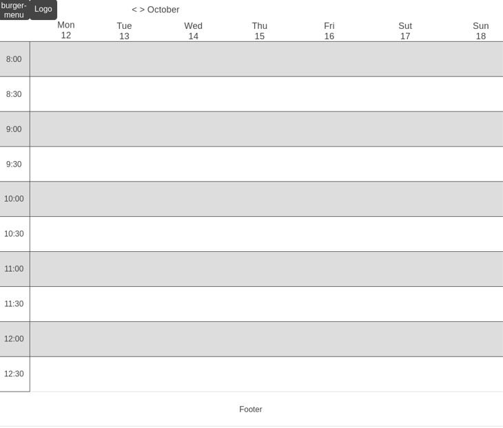

# Project Title
Blood Bank

## Overview

The blood bank application streamlines the appointment booking process for donors and medical staff, making it easier and more efficient for everyone involved.

### Problem Space

Blood donation centers often face challenges due to limited resources and staff availability, which makes managing appointments manually inefficient. Medical staff are often overburdened with administrative tasks such as scheduling, rescheduling, and managing donor information. This leads to operational bottlenecks, missed appointments, and lost opportunities for blood donations. The app helps alleviate these issues by automating appointment bookings, optimizing staff time, and improving overall resource management, enabling staff to focus on more critical tasks related to donor care and health.

### User Profile

Volunteers (Blood Donors):

-Volunteers will use the app to book appointments for blood donations. They can check available time slots, select convenient locations, and access their medical information and past donation history.
-The app must ensure that users can quickly access and update their medical eligibility for donating blood.

Medical Staff:

-Staff will use the app to check and manage the appointment schedule, view donor details, and ensure smooth coordination of donation sessions.

### Features

As a volunteer, I want to be able to log in to my account.
As a volunteer, I want to be able to see the calendar with available appointment slots and actual data.
As a volunteer, I want to be able to book an appointment for blood donation.
As a volunteer, I want to be able to see information about my upcoming and past appointments.
As a volunteer, I want to be able to view and update my personal information on my profile.
As a volunteer, I want to be able to log out of the system.
As a volunteer, I may want to check my medical eligibility or donation status before booking an appointment.

## Implementation

### Tech Stack

- React
- JavaScript
- MySQL
- Express
- Node.js
- Git
- Client libraries: 
    - react
    - react-router
    - react-big-calendar
    - scss
- Server libraries:
    - axios
    - knex
    - express
    - bcrypt for password hashing

### APIs

- OpenAI

### Sitemap

-Login Page

-Calendar Home page

-Volunteer Profile Page

-Volunteer Appointments Page

### Mockups

#### Home Page

### Data

### Endpoints

**GET /calendar**

- Description: Retrieves the schedule of appointments for a specific date range (default is the current week).

Parameters:
startDate (optional) – The start date for the range of appointments (YYYY-MM-DD).
endDate (optional) – The end date for the range of appointments (YYYY-MM-DD).

Example Request:
GET /api/calendar?startDate=2024-10-14&endDate=2024-10-20

Example Responce:

[
  { "appointmentId": "abc123", "volunteer": "John Doe", "date": "2024-10-14", "time": "10:00 AM" }
]

**POST /appointments**

Description: Creates a new appointment for a volunteer.
Parameters:
volunteerId – The ID of the volunteer booking the appointment.
date – The date of the appointment (YYYY-MM-DD).
time – The time of the appointment (HH:MM).

Example Request:

POST /api/appointments
{
  "volunteerId": "1",
  "date": "2024-10-16",
  "time": "10:00 AM"
}

[
  { "appointmentId": "abc123", "volunteerId": "1", "volunteer": "John Doe", "date": "2024-10-14", "time": "10:00 AM" }
]

**DELETE /appointments/:appointmentId**

Description: Deletes an existing appointment.
Parameters:
appointmentId – The ID of the appointment to be deleted.

Example Request:

DELETE /api/appointments/abc123

Example Response:

{ "message": "Appointment canceled successfully" }

**POST /login**

Parameters: email, password

Example Response:

{ "message": "Login successful", "token": "abcdef12345" }

**GET /user/:userId**

Parameters: userId

Example Response:

{
  "userId": "123",
  "name": "John Doe",
  "email": "john.doe@example.com",
  "medicalEligibility": "eligible",
  "dateOfBirth": "1990-05-15",
  "bloodType": "O+",
  "sex": "male"
}

### Auth

- JWT auth
    - Before adding auth, all API requests will be using a fake user with id 1
    - Added after core features have first been implemented

## Roadmap

Day 1-2: Core Setup & Backend Development
Project Setup:

Set up project environment, backend framework, and database.
Define data models: volunteer, appointment, and medical staff.
Create the initial structure for backend APIs.
Authentication & User Profile:

Implement User Registration and Login (volunteers and medical staff).
Implement GET /api/user/:userId endpoint with necessary profile fields (name, email, date of birth, blood type, sex).
Day 3-4: Appointment APIs
Calendar & Appointment Booking:

Implement GET /api/calendar for retrieving the schedule within a date range (startDate and endDate).
Implement POST /api/appointments to book new appointments.
Implement DELETE /api/appointments/:appointmentId to cancel appointments.
Basic Testing for Backend:

Ensure the basic functionality of user registration, login, and appointment management works through testing.
Day 5-6: Frontend – Calendar & API Integration
Calendar UI:
Build a basic calendar interface with week navigation (next/previous week).
Integrate GET /api/calendar to show appointment data in the calendar.
Appointment Modals:
Create a modal to display appointment details (with cancel and OK buttons) when clicking on an existing appointment.
Create a modal to book a new appointment when clicking on an empty time slot.
Day 7-8: Frontend – User Profile & Appointment Interaction
User Profile UI:

Display volunteer profile information (name, date of birth, blood type, sex).
Integrate profile data from GET /api/user/:userId.
Modal Functionality:

Ensure the modals for booking and canceling appointments work with the POST and DELETE appointment APIs.
Day 9: Testing & Bug Fixing
Backend Testing:
Perform unit and integration testing for all backend endpoints.
Frontend Testing:
Test the calendar and modals for proper integration with the backend.
Ensure appointment booking, display, and cancellation work smoothly.
Day 10-11: Final Touches & Documentation
Refinements:
Clean up UI/UX for the frontend and make any necessary improvements.
Optimize backend code and fix any identified bugs.
Documentation:
Write project documentation (API documentation, user guide).
Prepare any necessary diagrams to illustrate project structure.
Day 12: Final Review & Deployment
Deployment:

Deploy the project to a hosting service.
Do a final run-through of the project to ensure everything works as expected.
---

## Future Implementations
Add a second user with different role:

As medical staff, I want to be able to log in to my account securely.
As medical staff, I want to be able to view a calendar with all scheduled appointments for blood donations.
As medical staff, I want to be able to check donor profile information, including their upcoming and past appointments.
As medical staff, I want to be able to cancel appointments if needed.
As medical staff, I want to be able to log out of the system easily.

